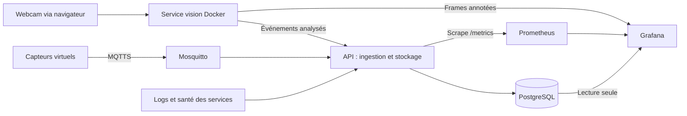

# THEWATCHER

Projet du Workshop EPSI BAC+4 2026, Mission Sentinel-X : l’Avant-Poste Industriel du Futur.

**The Watcher** rassemble les mesures de capteurs simulés, l’analyse vidéo, les alertes et la santé des services dans un dashboard unique.

L’équipe ne disposant ni de matériel ni de boîtier, le prototype sera entièrement logiciel. Les sources physiques seront simulées ou rejouées ; les échanges réseau, le stockage, les traitements IA et les contrôles de sécurité devront fonctionner réellement.

> État actuel : environnement Docker Compose complet avec broker MQTT sécurisé, API, PostgreSQL, Prometheus, Grafana et service vision YOLO/MediaPipe. La webcam Windows est transmise au conteneur par le navigateur afin d’éviter les limites USB de Docker Desktop.

## Organisation

Le dépôt reste organisé par responsabilités, sans frontend applicatif supplémentaire ni service de type « Engine ».

| Dossier | Contenu |
| --- | --- |
| [simulation/](simulation/) | Capteurs virtuels, scénarios reproductibles, sources vidéo et actionneurs simulés |
| [backend/](backend/) | Ingestion, API et stockage ; réception des résultats IA des collègues |
| [modeles-ia/](modeles-ia/) | Notebooks originaux du collègue et service vision Docker YOLO/MediaPipe |
| [infra/](infra/) | Docker Compose, Mosquitto, PostgreSQL, Prometheus et Grafana provisionné |
| [docs/](docs/) | Architecture, interfaces, protocole de démonstration et résultats |

Les responsabilités d’API et de stockage sont regroupées dans `backend`. `iot` est remplacé par `simulation`. Le travail de `cyber` rejoint `infra` et les contrôles applicatifs du backend ; la sécurité reste transverse. La vision reste isolée afin que son traitement CPU ne bloque pas l’ingestion.

## Architecture visée



Les données passent par l’ingestion avant stockage. Elle valide les messages, conserve le temps de mesure simulé et ajoute l’heure réelle de réception. Le simulateur et le navigateur n’accèdent jamais directement à la base.

Les composants des collègues produisent les mesures et les résultats d’analyse ; le backend les reçoit et les stocke. Il n’implémente pas leurs algorithmes. Les étiquettes de scénario servent à l’évaluation et ne doivent pas être fournies aux modèles comme variables prédictives.

## Stack proposée

| Besoin | Proposition minimale |
| --- | --- |
| Mesures synthétiques | Python + NumPy, scénarios JSON et graine fixée |
| Transport sécurisé | Client Paho MQTT et Mosquitto avec TLS |
| Vidéo | Webcam navigateur, YOLO11n et MediaPipe dans le conteneur vision |
| Analyse temporelle | Variables sur fenêtres et modèle statistique ou scikit-learn, évalué face à une référence simple |
| Backend | FastAPI, validation et accès au stockage |
| Stockage | PostgreSQL : mesures, événements et rejets persistants |
| Monitoring | Grafana : source PostgreSQL + source Prometheus |
| Déploiement | Docker Compose pour les services et volumes |

La séparation API / IA / stockage reste logique dans le code. Si nécessaire, la vidéo sera traitée dans un processus distinct pour ne pas bloquer l’API, sans créer un nouveau dossier racine.

## Scénarios visés

| Entrée simulée ou rejouée | Résultat réellement observable |
| --- | --- |
| Mesures normales avec bruit | Courbes et absence d’alerte injustifiée |
| Hausse progressive et corrélée température / gaz | Détection temporelle, explication et délai mesuré |
| Vidéo d’une personne entrant dans une zone | Détection calculée sur les images et événement horodaté |
| Arrêt des publications d’un device virtuel | État dégradé, jamais assimilé à un état normal |
| Message mal formé ou identifiants de test invalides | Rejet effectif et trace de validation ou d’authentification |
| Commande autorisée depuis le dashboard | État virtuel LED/buzzer et accusé de réception |

Afficher explicitement le mode simulation/rejeu. Un événement IA prédéfini peut tester l’interface, mais ne prouve pas le fonctionnement d’un modèle. Les observations peuvent être rapprochées par zone et par temps dans le backend, sans composant supplémentaire.

## Sécurité et fiabilité

- Chiffrer les flux, vérifier les certificats et authentifier les clients.
- Valider formats, tailles et valeurs ; limiter les débits et les droits MQTT.
- Faire passer les commandes par l’API avec autorisation et journalisation.
- Garder PostgreSQL sur le réseau Docker interne, les secrets hors du dépôt et les privilèges limités.
- Exposer seulement les ports nécessaires ; documenter firewall et SSH par clé lorsque utilisés.
- Afficher des états de sécurité réellement vérifiés et datés.
- Réserver les essais cyber au système local autorisé.
- Distinguer risque, fraîcheur des données, acquittement et résolution.

## Résultats et démonstration

Conserver un identifiant d’exécution, le scénario, sa graine, ses paramètres et les versions utilisées. Exporter mesures et détections en CSV/JSON, puis les graphiques pour le dossier.

Évaluer les faux positifs, incidents manqués, délais de détection, latences de bout en bout et temps de traitement vidéo. Séparer les scénarios de réglage de ceux d’évaluation, avec d’autres graines et amplitudes.

Les résultats synthétiques valident le fonctionnement dans les scénarios testés, pas la fiabilité industrielle ou la calibration de capteurs physiques.

Voir le [guide de simulation](docs/simulation.md) pour les technologies, figures et déroulé de démo.

## Adaptation du sujet

Le sujet original demande notamment ESP8266 avec firmware C++, webcam USB, OLED, actionneurs et boîtier fabriqué. Ces éléments ne seront pas réalisés matériellement. Faire confirmer par les coachs les modalités d’évaluation adaptées ; aucune dérogation déjà accordée n’est présumée ici.

La vision Python, l’analyse temporelle dépassant les simples seuils statiques, la supervision et les échanges sécurisés restent les objectifs logiciels. Docker Compose et Mosquitto, prescrits dans la section Infra, sont conservés. Les modèles cités dans le sujet restent des exemples. L’objectif inférieur à 100 ms par image reste à mesurer.

## Équipe et livrables

Les contributions directes sur `main` sont autorisées selon le choix de l’équipe ; branches et pull requests sont facultatives. Synchroniser le dépôt avant de travailler et faire des commits ciblés.

Priorité : simulateur → MQTT → backend → dashboard, puis IA, commandes et sécurité. Réserver du temps pour rejouer les scénarios, exporter les résultats et préparer la présentation.

Préparer le dossier technique avec schémas et poster A3, le support de soutenance, le teaser vertical et l’archive du code. Signaler aux coachs les éléments matériels absents et les adaptations des livrables.

## Installation

Docker Desktop démarré ou Docker Engine avec Compose v2 est nécessaire. Pour une première installation :

```sh
git clone https://github.com/AdamSawi/Sentinel-X.git
cd Sentinel-X
docker compose up --build -d --remove-orphans --wait
```

Le premier build peut prendre plusieurs minutes : il construit notamment l’image vision CPU avec PyTorch, YOLO11n et MediaPipe.

Depuis un dépôt déjà cloné, reconstruire et démarrer les services :

```sh
docker compose up --build -d --remove-orphans --wait
```

Vérifier leur état et consulter les logs :

```sh
docker compose ps
docker compose logs --tail=50 vision backend mqtt postgres prometheus grafana
```

Arrêter les services en conservant les données et les identifiants :

```sh
docker compose down
```

Relancer les conteneurs existants sans reconstruire les images :

```sh
docker compose up -d --wait
```

Récupérer une nouvelle version du projet et reconstruire ce qui a changé :

```sh
git pull
docker compose up --build -d --remove-orphans --wait
```

### Ports et accès

| Service | Adresse locale | Port |
| --- | --- | --- |
| Grafana | http://localhost:3000 | 3000 |
| Vision IA / test caméra | http://localhost:8090 | 8090 |
| API | http://localhost:8080 | 8080 |
| MQTT TLS | localhost | 8883 |
| MQTT WebSocket TLS | Réseau Docker interne | 9001, non publié |
| Prometheus | Interne Docker uniquement | 9090, non publié |
| PostgreSQL | Interne Docker uniquement | 5432, non publié |

Les ports publiés écoutent uniquement sur 127.0.0.1. Les capteurs restent en attente tant qu’aucun simulateur n’envoie de données. La vision fonctionne dès que l’utilisateur autorise la webcam dans Grafana.

### Identifiants Grafana de l’instance actuelle

- URL : **http://localhost:3000**
- Utilisateur : **admin**
- Mot de passe : `c5da48c1a93da9c6b378852ac211e3d79fd5d0f698506535`

Ce mot de passe correspond à l’instance existante. Une nouvelle installation avec des volumes neufs génère son propre mot de passe ; pour le récupérer :

```sh
docker compose exec mqtt cat /run/sentinel/grafana-admin.password
```

Après connexion, ouvrir le dashboard **Sentinel-X · Centre de contrôle** dans le dossier **Sentinel-X**, cliquer sur **ACTIVER LA CAMÉRA**, puis autoriser son utilisation dans le navigateur.

Le traitement intégré ne nécessite pas Jupyter. Les notebooks originaux restent disponibles comme travail source du collègue. Voir [le guide du service vision](modeles-ia/README.md) pour le flux navigateur, les modèles et les données transmises.

Voir le [guide Docker et les contrats de connexion](docs/docker.md) pour MQTT, l’API événements, l’accès Grafana, les contrôles de santé et les limites de cette configuration locale.
