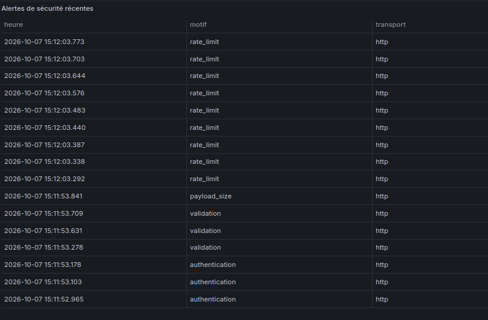
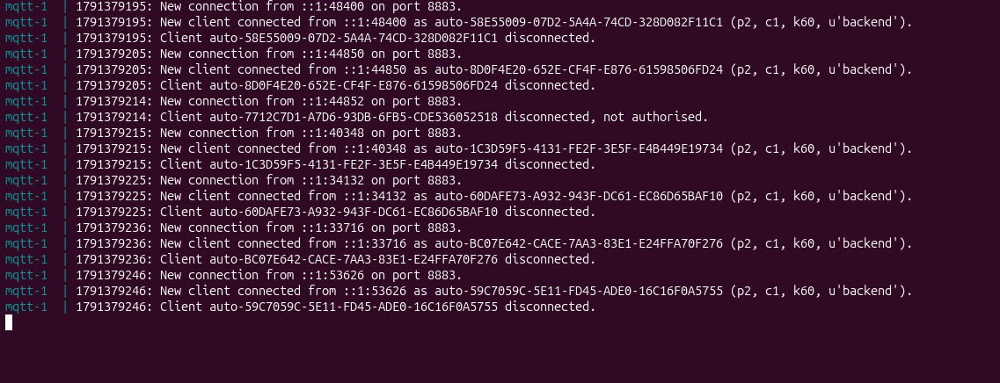

# Bilan cybersécurité — 7 octobre 2026

> Sentinel-X / The Watcher — Partie cyber (Nico)
> Analyse détaillée des risques et recommandations : [rapport-cyber.md](rapport-cyber.md)

## Objectif

Vérifier que la sécurité du prototype fonctionne réellement, corriger les faiblesses trouvées et en apporter la preuve.

**Environnement :** stack Docker Compose complète (6 services) sur une VM Ubuntu, en local uniquement.

## Ce qui a été fait

1. **Audit du dépôt** : configuration Docker, MQTT, base de données, Grafana, code de l'API et du service vision. Aucun secret n'a été trouvé dans l'historique Git.
2. **Correction de 3 faiblesses**, détaillées ci-dessous.
3. **Création d'un script de tests automatisés** (`cybersecurite/tests-cyber.sh`) qui rejoue 25 attaques et vérifie qu'elles sont bloquées.
4. **Vérification de la traçabilité** dans Grafana et dans les logs du broker MQTT.

## Correctifs

| Faiblesse | Risque | Correctif | Résultat |
| --- | --- | --- | --- |
| `.gitignore` sans règle pour les clés privées | Fuite d'une clé sur GitHub | Ajout de `*.key` et `*.pem` | Clés ignorées par Git |
| Documentation `/docs` de l'API publique | Liste des routes offerte à un attaquant | Documentation désactivée (`backend/app.py`) | HTTP 404 |
| Le service vision acceptait tout type de données | Une page web piégée pouvait créer de fausses détections | Seules les images JPEG sont acceptées (`modeles-ia/service.py`) | HTTP 415 |

```diff
# backend/app.py
-app = FastAPI(title='Sentinel-X Integration API', lifespan=lifespan)
+app = FastAPI(title='Sentinel-X Integration API', lifespan=lifespan,
+              docs_url=None, redoc_url=None, openapi_url=None)

# modeles-ia/service.py
 async def analyze_frame(request: FastAPIRequest):
+    if request.headers.get('content-type', '').split(';')[0].strip() != 'image/jpeg':
+        raise HTTPException(415, 'Seules les images JPEG sont acceptees')
```

## Résultats des tests : 25 / 25

| Catégorie | Attaques | Résultat |
| --- | --- | --- |
| MQTT | Anonyme, mauvais mot de passe, sans TLS, port en clair | 4/4 bloquées |
| Droits MQTT (ACL) | Le compte capteurs se fait passer pour la caméra | Bloqué |
| API | Sans jeton, faux jeton, jeton d'un autre rôle | 3/3 refusées |
| Données piégées | JSON cassé, 999 °C, champ inconnu, 20 Ko, rejeu | 5/5 refusées |
| Correctifs | `/docs`, données non JPEG | 404 et 415 |
| Grafana et base | Sans connexion, écriture en lecture seule | 2/2 refusées |
| Réseau | Ports internes et accès depuis l'IP de la VM | 6/6 fermés |
| Inondation | Rafale de 125 requêtes | Bloquée au-delà de la limite |

<details>
<summary>Log complet du script de tests</summary>

```text
=== Tests de sécurité Sentinel-X - 07/10/2026 15:11:44 - run cyber-1791378704 ===

1. MQTT : chiffrement et authentification
  [OK]    Connexion anonyme refusée
  [OK]    Mauvais mot de passe refusé
  [OK]    Connexion sans TLS refusée sur 8883
  [OK]    Aucun port MQTT en clair (1883)

2. MQTT : droits par compte (ACL)
  [OK]    Compte 'sensors' publiant un événement vision : non stocké (attendu absent, obtenu absent)
  [OK]    Témoin : compte 'vision' autorisé : stocké (attendu present, obtenu present)

3. API : authentification des producteurs
  [OK]    POST sans jeton (attendu 401, obtenu 401)
  [OK]    POST avec un faux jeton (attendu 401, obtenu 401)
  [OK]    POST avec le jeton d'un autre rôle (vision -> mesures) (attendu 401, obtenu 401)

4. API : validation des données
  [OK]    JSON mal formé (attendu 422, obtenu 422)
  [OK]    Température hors limites (999 °C) (attendu 422, obtenu 422)
  [OK]    Champ inconnu injecté (attendu 422, obtenu 422)
  [OK]    Message trop gros (20 Ko) (attendu 413, obtenu 413)
  [OK]    Rejeu du même message : pas de doublon

5. Correctifs de l'étape 2
  [OK]    Documentation /docs de l'API masquée (attendu 404, obtenu 404)
  [OK]    Service vision : données non JPEG refusées (attendu 415, obtenu 415)

6. Grafana et base de données
  [OK]    Grafana sans connexion (attendu 401, obtenu 401)
  [OK]    Compte Grafana en lecture seule : écriture refusée

7. Exposition réseau
  [OK]    Port 5432 (interne) non publié sur la VM (attendu ferme, obtenu ferme)
  [OK]    Port 9090 (interne) non publié sur la VM (attendu ferme, obtenu ferme)
  [OK]    Port 3000 non joignable depuis le réseau (192.168.211.130) (attendu ferme, obtenu ferme)
  [OK]    Port 8080 non joignable depuis le réseau (192.168.211.130) (attendu ferme, obtenu ferme)
  [OK]    Port 8090 non joignable depuis le réseau (192.168.211.130) (attendu ferme, obtenu ferme)
  [OK]    Port 8883 non joignable depuis le réseau (192.168.211.130) (attendu ferme, obtenu ferme)

8. Limitation de débit (dernier test : bloque le compte 'sensors' en HTTP pendant 1 minute)
  [OK]    Rafale de 125 requêtes : 9 bloquées (429)

=== Résultat : 25 OK, 0 échec(s) - détail enregistré dans cybersecurite/resultats-tests-20261007-1511.txt ===
```

</details>

## Preuves de traçabilité

### Rejets visibles dans Grafana

Chaque attaque bloquée par l'API est enregistrée et affichée dans le panneau « Alertes de sécurité récentes » : 3 échecs d'authentification, 3 erreurs de validation, 1 message trop gros et 9 requêtes freinées.



### Refus dans les logs du broker MQTT

Une connexion avec un mauvais mot de passe est refusée par Mosquitto. Les lignes `u'backend'` correspondent au contrôle de santé automatique.

```text
mqtt-1 | 1791379214: New connection from ::1:44852 on port 8883.
mqtt-1 | 1791379214: Client auto-7712C7D1-A7D6-93DB-6FB5-CDE536052518 disconnected, not authorised.
```



## À retenir

- La sécurité du prototype a été **vérifiée par des attaques réelles**, pas seulement décrite.
- **3 faiblesses corrigées** sans casser la démonstration (caméra et dashboard fonctionnels).
- Les tests sont **rejouables** avec `bash cybersecurite/tests-cyber.sh`.
- Limites connues (HTTP en local, certificat autosigné, ACL par rôle) : voir la section 7 du [rapport cyber](rapport-cyber.md).
